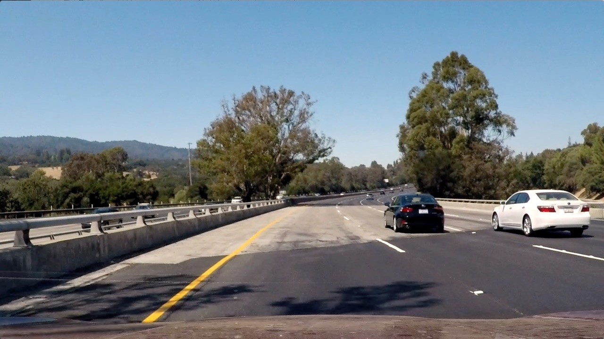
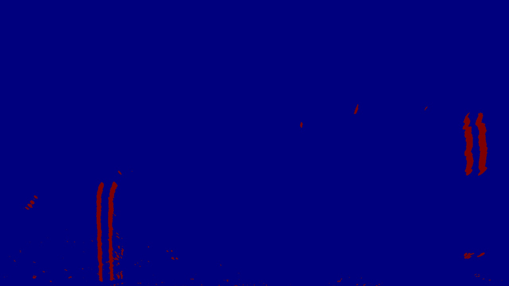

## Advanced Lane Finding

### Camera Calibration

Camera was calibrated using 20 chessboard pattern images provided in the project repository.

The code that performs camera calibration can be found [here](./sdc/utils.py).

calibrateCamera() takes as input the path to the calibration images directory and outputs the calibration matrix and distortion coefficients. This method uses OpenCV methods findChessboardCorners() and calibrateCamera() to calculate the calibration coefficients. These coefficients are saved in a pickle file in order to avoid calculating them over and over again.

An example of an original chessboard image and the corresponding distortion corrected image is provided below.

<table>
  <tr>
    <th>Original</th>
    <th>Undistorted</th>
  <tr>
  <tr>
   <td></td>
   <td></td>
  </tr>
</table>

### Pipeline (test images)

The image processing pipeline consists of the following steps:
* Apply gaussian blur to original image to reduce noise
* Un-distort the resulting image using the camera calibration coefficients calculated previously.
* Apply perspective transform to create a bird-eye view of the image.
* Create a binary image by applying color and/or gradient thresholding
* Create a binary image for each of the lines
* Apply polynomial fit to each binary line images
* Draw the lines on the bird-eye view
* Apply inverse perspective transform to convert the image from bird-eye view to regular view
* Overlap image with lines to undistorted image
* Calculate Curvature and vehicle position with respect to center and render them on the image

The set of transformation applied to an image is presented below.

<table>
  <tr>
    <th>Original</th>
    <th>Undistorted</th>
  <tr>
  <tr>
   <td></td>
   <td></td>
  </tr>
  <tr>
    <th>Bird Eye</th>
    <th>Color Binary</th>
  <tr>
  <tr>
   <td></td>
   <td></td>
  </tr>
  <tr>
    <th>Gradient Binary</th>
    <th>Combined Binary</th>
  <tr>
  <tr>
   <td></td>
   <td></td>
  </tr>
  <tr>
    <th>Left</th>
    <th>Right</th>
  <tr>
  <tr>
   <td></td>
   <td></td>
  </tr>
  <tr>
    <th>Lines Fit</th>
    <th>Lines Fit Unwarped</th>
  <tr>
  <tr>
   <td></td>
   <td></td>
  </tr>
  <tr>
    <th>Overlapped</th>
    <th>Result</th>
  <tr>
  <tr>
   <td></td>
   <td></td>
  </tr>
</table>

#### Perspective transform
The goal of the perspective transform is to provide a bird eye view of the lines so they appear parallel in the transformed image. Transforming back and forth between regular and bird-eye view is done using two transformation matrices.

The method that calculates these matrices is called get_transformation_matrices() and can be found [here](./sdc/camera.py). This method uses OpenCV's getPerspectiveTransform() and manually provided source and destination points. An example of the bird-eye image was presented above and as expected shows the parallel lanes.

#### Creating the binary image
The binary image is created using a combination of color gradient thresholding. Color thresholding first transforms the image from RGB to HLS space then applies a threshold on S channel.

Gradient thresholding first transform the image into the gray scale the calculates Sobel gradient along x axis because this gradient will emphasize vertical lines.

The combined binary puts the two binaries together. Examples of these binary images can be found above.

The code that creates binary images can be found [here](./sdc/camera.py)

#### Line identification
There are two methods for extracting line pixels. The first method can be applied for the first frame or when the lines have to be identified from scratch. The second method relies on lines identified in the previous frame.

##### Identifying lines for first frame
The first step is calculating the moving average for pixel intensities across x axis for a binary image.

To identify pixels from the left lane we determine the x coordinates that exceed a certain threshold and we retain all pixels on the left half of the image that are between these coordinates. We use a similar approach for the right lane. Although this approach is much simpler than the sliding window approach it performs surprisingly well. This idea was originally presented by Vivek Yadav in this [paper](https://medium.com/@vivek.yadav/robust-lane-finding-using-advanced-computer-vision-techniques-mid-project-update-540387e95ed3#.h5ihmyh3b).

In some cases we could not identify small enough regions that meet these criteria. In this case we ended up using the gradient binary versus the combined binary. This turned out to work well especially for images with a lot of shade as shown below.

<table>
  <tr>
    <th>Original</th>
    <th>Bird Eye</th>
  <tr>
  <tr>
   <td></td>
   <td></td>
  </tr>
  <tr>
    <th>Combined Binary</th>
    <th>Gradient Binary</th>
  <tr>
  <tr>
   <td></td>
   <td></td>
  </tr>
  <tr>
    <th>Left</th>
    <th>Right</th>
  <tr>
  <tr>
   <td></td>
   <td></td>
  </tr>
</table>  

The methods that extract the line pixels are extract_lines() and extract_best_lines() and can be found [here](./sdc/line_detector.py).

##### Identifying lines using lines from previous frame
This method splits the image into top and bottom half, then retains all pixels in a band around x coordinates for both left and right lines. The method that extract the lines is fast_extract() and can be found [here](./sdc/line_detector.py).

Once the left and right line pixels are identified we approximate these points with a second degree polynomial using numpy's polyfit()

##### Finding best fit
Extracting line pixels does not mean that we identified the correct lines. The verify the lines validity we check that left and right lines are roughly parallel and we also check that the new lines do not deviate too much from the previous lines. The method that finds the best fit is surprisingly called find_best_fit() and can be found here. This methods first attempts to use the fast_extract() if possible. It this fails it tries to use the same method used for identifying lines for the first frame. If this fails as well then use the last known fit if it is recent enough(e.g. less than 5 frames ago).

To avoid jitter we are using a smoothing factor before refreshing current fit data.

#### Radius of curvature and vehicle position
The radius of curvature is calculated using the polynomial coefficients from the current fit and the method presented in class. The method that performs this calculation is calculate_curvature_meters() and can be found [here](./sdc/line_detector.py).

Vehicle position is determined by calculating the difference between the middle of the image and the average value of the x coordinates for the left and right lines at the bottom of the image. The method that calculates vehicle position is calculate_vehicle_offset()

### Pipeline (video)
We used moviepy to apply the image transformation to the project video. The resulting video can be found [here](https://youtu.be/OV1l5xFHiwQ)

### Discussion
Making this work included lots of experimentation and tweaking of parameters. These parameters were tweaked using test images from the problem areas in the project video. There were three areas that required experimentation/tweaking:
 - First area of experimentation involved generating good binary images. This meant experimenting with color thresholding, color spaces, and various gradients. We found out that in some cases gradient binary image works better that the combined binary.
 - Second area of experimentation involved extracting left and right lanes from binary images. Instead of using a sliding window technique we decided to use a simpler approach based on moving average. This turned out to work reasonably well.
 - Third area of experimentation involved determining criteria for what constitutes a good fit.

Existing approach performs well on the project video but does not perform that well on the challenge videos. The performance can be improved by focusing on the three areas described above.

We can use more techniques for generating binary images like using the magnitude of the gradient, calculating the gradient using a different channel (S channel may work well). Also we can combine these techniques different ways depending on things like lighting conditions, image quality etc. We already used something similar for handling images with a lot of shade.

Extracting lines from binary images may benefit from a more sophisticated approach as well. For example we can split the image into multiple horizontal slices and exclude the slices that are of poor quality.

These suggestions involve tweaking lots of parameters and using a relatively slow approach that requires handling problem areas one by one. A different approach that may generalize better is to try to use CNN's. That would require no tweaking but it also means we lose intuition about what works and what does not.
