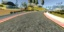

### Behavioral Cloning

The goal of this project is to train a Deep Neural Network to drive a car around a track using Udacity's simulator. The training data is collected by manually driving the car around the track so the model needs to learn to mimic the behavior of a real user.


#### Training data

Udacity's Simulator can be run either in Training Mode or Autonomous Mode. In Training Mode the simulator collects 9-10 data points per second. Each datapoint consists of the following fields:
 - center image
 - left image
 - right image
 - steering
 - throttle
 - break
 - speed

The Simulator can be controlled either using the keyboard or a game controller. It turns out data collected via game controller is much higher quality than data collected via keyboard. Since when I did this project I did not have access to a game controller I ended up using the training data provided by Udacity.

#### Data analysis

The Training data set contains 8036 data points. Steering has values decimal values between -1 and 1. The following histogram shows the distribution of these values and makes it clear that more than half of the values have zero steering.


#### Data processing

Each image is cropped to only include rows between 50 and 137. Removing the top gets rid of irrelevant features like landscape, trees etc and removing the bottom gets rid of the car hood. After cropping the images were resized to 32x64. This processing step is performed for both the training images and the images feed from the simulator during Autonomous Mode.

Another data processing step is data normalization. This is performed by a Lambda layer in the model.

Original Image (160x320)


Proceesed Image (32x64)



#### Data Augmentation
Training data was augmented using the following mechanisms:
 - adjust steering value when using left of right images. The reason for doing this is pretty simple. Imagine we have three cars driving in parallel. Our goal is to be in the center since that is the optimal route. So for the car on the left we need to steer right and for the car on the left we need to steer left. The steering adjustment controls how quickly we want to move to the center.
 - the track used for collecting training images has more left than right turns. To balance the data and avoid biasing the car to turn left we flipped each image vertically and also reverted the steering value. This results in creating a mirror image for the track and has the same effect as driving around the track in the opposite direction.
 - a lot of the images have zero steering value. To make training more efficient and to train the car to actually steer we sampled larger steering angles more frequently that small steering angles.

#### Model Architecture
We experimented with three different models. The first model was the Nvidia model. The second model consisted of 3 Convolution Layers with Max Pooling, a Flattened layer and 4 Fully Connected layers. These two models did not provide satisfactory results consistently. The model that performed best was a model very similar with the one we used for the Traffic Signs classification project with minor tweaks. This model is summarized below:
```
____________________________________________________________________________________________________
Layer (type)                     Output Shape          Param #     Connected to                     
====================================================================================================
Normalization (Lambda)           (None, 32, 64, 3)     0           lambda_input_1[0][0]             
____________________________________________________________________________________________________
Conv1 (Convolution2D)            (None, 32, 64, 32)    896         Normalization[0][0]              
____________________________________________________________________________________________________
LeakyRelu1 (LeakyReLU)           (None, 32, 64, 32)    0           Conv1[0][0]                      
____________________________________________________________________________________________________
Conv2 (Convolution2D)            (None, 30, 62, 32)    9248        LeakyRelu1[0][0]                 
____________________________________________________________________________________________________
LeakyRelu2 (LeakyReLU)           (None, 30, 62, 32)    0           Conv2[0][0]                      
____________________________________________________________________________________________________
MaxPool1 (MaxPooling2D)          (None, 15, 31, 32)    0           LeakyRelu2[0][0]                 
____________________________________________________________________________________________________
Dropout_0.5_1 (Dropout)          (None, 15, 31, 32)    0           MaxPool1[0][0]                   
____________________________________________________________________________________________________
Conv3 (Convolution2D)            (None, 15, 31, 64)    18496       Dropout_0.5_1[0][0]              
____________________________________________________________________________________________________
Leaky Relu 3 (LeakyReLU)         (None, 15, 31, 64)    0           Conv3[0][0]                      
____________________________________________________________________________________________________
Conv4 (Convolution2D)            (None, 13, 29, 64)    36928       Leaky Relu 3[0][0]               
____________________________________________________________________________________________________
Leaky Relu 4 (LeakyReLU)         (None, 13, 29, 64)    0           Conv4[0][0]                      
____________________________________________________________________________________________________
MaxPool1 (MaxPooling2D)          (None, 6, 14, 64)     0           Leaky Relu 4[0][0]               
____________________________________________________________________________________________________
Dropout_0.5_2 (Dropout)          (None, 6, 14, 64)     0           MaxPool1[0][0]                   
____________________________________________________________________________________________________
Flatten (Flatten)                (None, 5376)          0           Dropout_0.5_2[0][0]              
____________________________________________________________________________________________________
Dense512 (Dense)                 (None, 512)           2753024     Flatten[0][0]                    
____________________________________________________________________________________________________
Leaky Relu 5 (LeakyReLU)         (None, 512)           0           Dense512[0][0]                   
____________________________________________________________________________________________________
Dropout_0.5_3 (Dropout)          (None, 512)           0           Leaky Relu 5[0][0]               
____________________________________________________________________________________________________
Output (Dense)                   (None, 1)             513         Dropout_0.5_3[0][0]              
====================================================================================================
Total params: 2819105
____________________________________________________________________________________________________

```

#### Model Tuning
In order to tune the model we experimented with the following parameters:
 - different activations: RELU, ELU and LeakyRELU. For this project LeakyRELU performed best
 - different values for Dropout. Initially we used 0.25 for Dropout between Convolutional Layers but in the end we decided to use Dropout(0.5) throughout to reduce change of overfitting
 - tuned the bias for selecting images with large steering value. One alternative I did not experiment with is to use different bias values for different epochs. For example start including more and more small steering values as training progresses.
 - tuned steering angle adjustment when using left or right images. Optimal value seems to be around 0.15 - 0.2. Selecting higher values results in wavy driving while lower values seem to require more training.

The optimized used in this project is Adam with default settings.

#### Image Generator
Training data was submitted in batches of 32 images using a custom generator that produced both the augmented image and the corresponding steering value. Using an image generator uses memory efficiently and is more scalable.

#### Results and discussion
The model included in this project was trained on 10 epochs using 10,000 images per epoch.

The model performed well on Track1 as seen in the recoding below.

[Track 1 Video Recording](https://youtu.be/W5o-G6e78Zk)

The model generalizes well on Track 2 but it gets stuck at a very sharp right turn when using the drive.py script provided by Udacity.

[Track 2 Video with Default Settings](https://youtu.be/l-aap46K_Wk)

In order to complete Track 2 successfully I adjusted the throttle to handle very steep slopes and also multiplied the steering to handle very sharp turns. This resulted in the model driving like it is on crack but at least it is completed Track 2.

[Track 2 Video with Adjusted Settings](https://youtu.be/n8hbFaPRSDg)

It is important to note that the loss is not a good measure of the model quality. A model can have a very low loss and perform worse than a model with an average loss. The quality of the model can be assessed by testing the model on the track. This makes intuitive sense. The loss looks at each image individually and it measures the mean square error between actual and predicted steering. On the other hand it makes more sense to assess the model using a more wholistic view that looks at multiple frames at a time or even at larger portions of the track.

Initially I split the data into train/validation/test but once I realized the MSE  is not a good measure for model quality I stoped doing this. When I did the split the MSE errors for training, validation and test sets were similar. A better measure for me was to actually test the car on the track, see how it negociates turns and how it behaves on Track 2.
