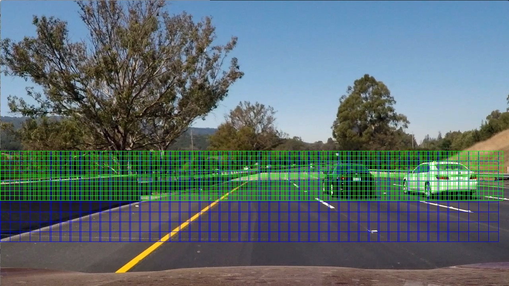
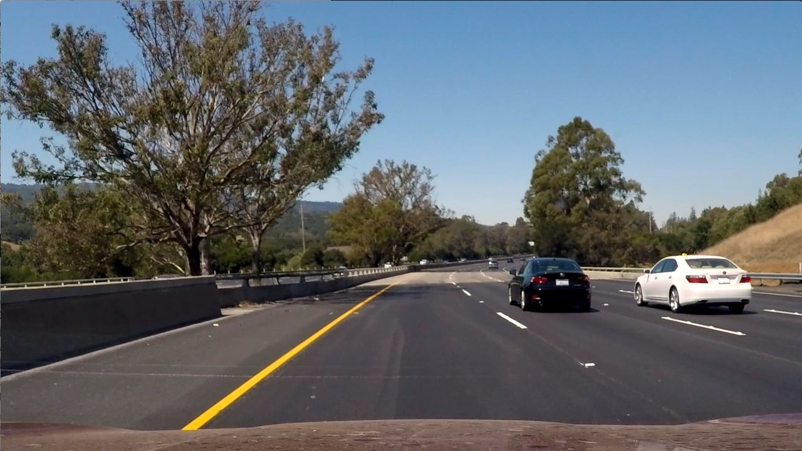
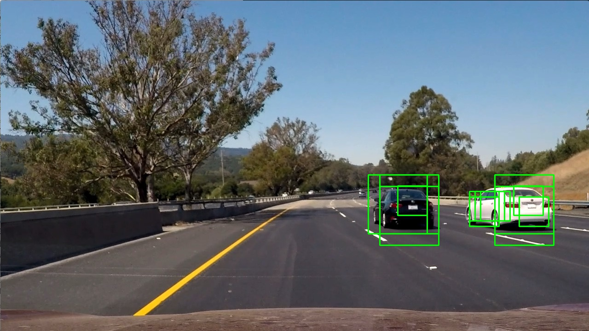
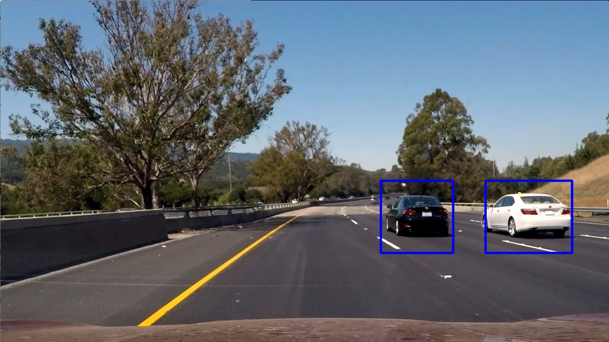

## Vehicle Detection

The goal of this project is to write a software pipeline to identify vehicles in a video

### Histogram of Oriented Gradients (HOG)

#### Extracting Image Features

The code that extracts image features is in [feature_extractor.py](./sdc/feature_extractor.py). For this project I used two types of features: HOG and color histograms. I experimented with different color spaces and HOG parameters and I chose the parameters that had good test accuracy and also performed well on test images. For color spaces both YUV and YCrCb performed well with YCrCb having a slight edge. For the HOG parameters the values provided in the lecture notes, `orientations=9, pixels_per_cell=8 and cells_per_block=2` performed well.

The 32 color histogram features were concatenated with 1764 HOG features for each channel to produce a 3*(32+1764) = 5388 feature vector.

#### Model Training

For training we used the 8792 car images and 9666 non-car images provided with the project. The training data was split into training and testing sets using a 80/20 split. The features were next scaled using `sklearn StandardScaler`. The model was trained using `LinearSVC` with default parameters. In order to be able to calculate prediction probabilities `LinearSVC` was wrapped by `CalibratedClassifierCV`.

The trained model had 1.0 Training Accuracy and 0.993 Testing Accuracy. After training the model was saved in pickle files that were later used when processing the video.

The code that trains the model is in [train_model.py](./sdc/train_model.py)

### Sliding Window Search

#### Sliding Window implementation

After experimenting with several window sizes (64x64, 96x64, 128x128, 192x128, 256x128) we decided to only used 128x128 and 64x64 windows with an 0.8 overlap based on the classification performance on test images.

The following image shows 64x64 windows in green and 128x128 windows in blue.

The method that implements the sliding window technique is `slide_window()` in [feature_extractor.py](./sdc/feature_extractor.py). This method is invoked by `get_all_sliding_windows()` in [vehicle_detection.py](./sdc/vehicle_detection.py)

#### Image Pipeline
The sliding windows technique was used to identify image sections that contain cars. In order to reduce false positives we only retained windows that had a prediction probability higher than a threshold value(defaults to 0.8). These windows were used to create a heatmap that was thresholded again to further eliminate false positives. We then used `scipy.ndimage.measurements.label` to identify clusters in the heatmap that were labeled as vehicles.

The code that builds the heatmap and applies these thresholding techniques is in [car_tracker.py](./sdc/car_tracker.py)

The following set of images shows how this works.

<table>
  <tr>
    <th>Original</th>
    <th>Car Windows</th>
  <tr>
  <tr>
   <td></td>
   <td></td>
  </tr>
  <tr>
    <th>Heatmap</th>
    <th>Potential Cars</th>
  <tr>
  <tr>
   <td></td>
   <td></td>
  </tr>
</table>

### Video Implementation

When processing the video the [`ClassTracker`](./sdc/car_tracker.py) class keeps track of the last 15 frames and it also maintains a list of previously identified cars. Potential car boxes are added if they either pass the probability threshold used for single image processing or if the center of the box is close to a previously identified car. Since we are also tracking multiple frames in a video we also increased the heatmap threshold to 5. This ensures a candidate car is identified in multiple frames before being considered a car.

#### Final Video Output

### Discussion
This was an interesting project that required experimenting with various parameters to make it work.

If using HOG there are several opportunities for improving performance.  
- calculate HOG only once for the entire section covered by each sliding window size and then to extract only the needed array elements as we slide windows over the sections.
- experiment with CV2 HOG extractor and see if it provides better performance.
- use more sophisticated techniques to identify blobs in the heat much such as watershed

Since the final results require so much parameter tuning I am not convinced that this is the most robust approach for vehicle identification. I believe using something like U-Net or YOLO can provide better results and this is what I intend to experiment with next.

### Vehicle Detection video with DL

